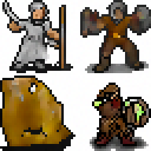

# pixel-art-diffusion
A small project, using a diffusion model to generate 32x32 pixel art characters. I trained a model which is [over here](models/AOS_AOF) on some 32x32 pixel art characters.

## Usage
This project uses PyTorch 1.11.0, Numpy 1.22.3, TorchVision 0.12.0, matplotlib 3.5.1 and tqdm.

To sample from the model, use sample.py
```
sample.py ../models/AOS_AOF.pt 4 -o out.png -noise_mul 8
```

(as you can see, quality is quite variable. I got the best results using CLIP re-ranking with the term 'pixel art character')

To train the model, use train.py. To start from scratch:
```
train.py ../../data/*.png -save_path model.pt
```

To finetune:
```
train.py ../../data/*.png -load_path ../models/AOS_AOF.pt -save_path model.pt
```

Note that the code has some quirks as it was written with the assumption that the dataset size is quite small (so one epoch is not assumed to take very long). This is because my dataset was only about ~2k big.
