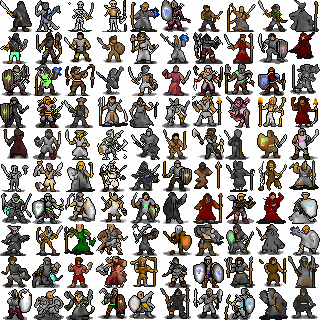

# pixel-art-diffusion
A small project, using a diffusion model to generate 32x32 pixel art characters. I trained a model which is [over here](models) on some 32x32 pixel art characters. The architecture is (supposed to be) similar to the one from [this paper](https://arxiv.org/abs/2105.05233).

## Usage
This project uses PyTorch 1.11.0, Numpy 1.22.3, TorchVision 0.12.0, matplotlib 3.5.1 and tqdm.

To sample from the model, use sample.py
```
sample.py ../models/AOS_AOF.pt 4 -o out.png -noise_mul 8
```

which will give you an image similar to


As you can see, the quality is very variable... It works best if you use CLIP to find the good ones with the caption 'cool pixel art character' or something 😎. Here's the best 100 out of 1000 samples, according to CLIP:




To train the model, use train.py. E.g. to train from scratch on your own data:
```
train.py ../../data/*.png -save_path model.pt
```

Or to load from a checkpoint:
```
train.py ../../data/*.png -load_path ../models/AOS_AOF.pt -save_path model.pt
```

I have not included the dataset I used, but you can find information on it in models/README.txt.

The code has some quirks as it was written with the assumption that the dataset size is quite small (so one epoch is assumed to take not much time). This is because my dataset was only about ~2k images big :)

(Also, I haven't tested this on images that aren't 32x32, so there might be issues there)
